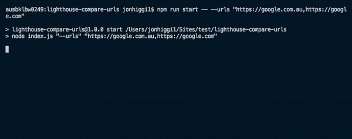

# lighthouse-compare-urls

 

CLI tool to compare two URLs via Google's [Lighthouse](https://github.com/GoogleChrome/lighthouse) to check for performance differences.

Useful for comparing an staging URL with changes against a current live site to see the performance impact of changes.

Results are exported as XLSX file in `results` directory.

## Install

- `npm install lighthouse-compare-urls -g`

## Run

- `lighthouse-compare-urls --urls "[URL 1],[URL 2]"`, e.g. `lighthouse-compare-urls --urls "https://google.com.au,https://google.co.uk"`
- If you supply more than two the URLs will be split up into multiple tests of two URLs, e.g. `lighthouse-compare-urls --urls "https://google.com.au,https://google.com,https://www.google.co.uk/,https://www.google.fr"`

### Options:

- `--urls "[URL 1],[URL 2]"` (required) supply URLs to be tests
- `--jsonExport` export all Lighthouse results (large file) to `/results`

## Test

- `npm test` and `npm run test:watch`. Tests are written in [Jest](https://jestjs.io).
